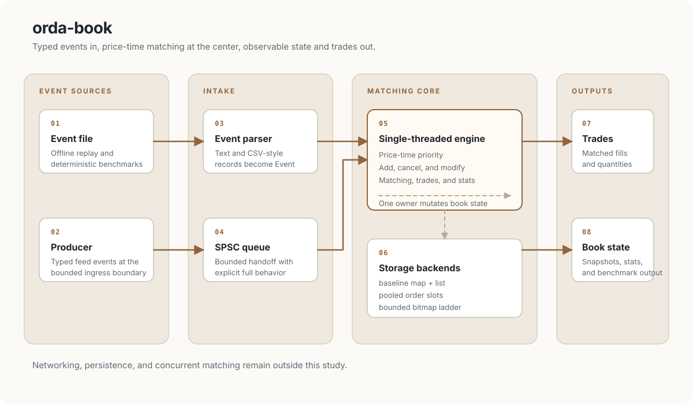

# orda-book

orda-book is a small single-threaded limit order book in C++17.

It matches limit orders using price-time priority, supports offline replay, and
measures both throughput and per-event latency on deterministic workloads.



## Measured snapshot

Release build on commit `3c79930`, measured on a MacBookAir10,1 with Apple
Clang 21.0.0, arm64, 200,000 generated events, three rounds, and seed
`305419896`.

| backend | cross-heavy throughput | modify-heavy p99 | allocations/event |
| --- | ---: | ---: | ---: |
| baseline | 10.2M ev/s | 375 ns | 1.60 |
| pooled | 18.3M ev/s | 292 ns | 0.801 |
| ladder | 8.12M ev/s | 292 ns | 1.60 |

Throughput uses `--no-latency --reuse-trades`.

Latency uses `--reuse-trades` with timestamp collection enabled.

Allocation counts come from the separate 500,000-event allocation campaign.

These are local comparison points, not production exchange performance claims.

See [`docs/BENCHMARK_RESULTS.md`](docs/BENCHMARK_RESULTS.md) for the full
workload matrix and measurement details.

| verification | status |
| --- | --- |
| Release CTest | passed locally |
| AddressSanitizer CTest | passed locally |
| ThreadSanitizer | configured in Linux CI |
| Differential libFuzzer | configured in Linux CI; unavailable in the local macOS toolchain |

## Quickstart

Requirements: CMake 3.20 or newer and a C++17 compiler.

```sh
cmake -S . -B build -DCMAKE_BUILD_TYPE=Debug
cmake --build build --parallel
ctest --test-dir build --output-on-failure
```

Replay a sample event file:

```sh
./build/orda_replay data/sample_events.txt
./build/orda_replay data/sample_events.txt --top
```

Run a benchmark:

```sh
./build/orda_benchmark --file data/benchmark_events.txt --rounds 5
./build/orda_benchmark \
  --events 200000 \
  --workload cross-heavy \
  --rounds 5 \
  --seed 305419896
```

Select the experimental pooled backend with `--backend pooled`.

Select the bounded price-ladder backend with `--backend ladder`.

The default is `--backend baseline`.

For a timer-free throughput comparison, reuse the trade buffer and disable
per-event latency collection:

```sh
./build/orda_benchmark \
  --events 200000 \
  --workload cross-heavy \
  --rounds 5 \
  --seed 305419896 \
  --no-latency \
  --reuse-trades
```

## What it contains

- Ordered bid and ask price levels.
- FIFO queues within each price level.
- Experimental preallocated order-slot backend.
- Experimental bounded price-ladder backend.
- Bounded single-producer/single-consumer ingress queue.
- Threaded ingress benchmark with queue-delay percentiles.
- Order-ID lookup for cancellation and modification.
- Add, cancel, and cancel-replace modification events.
- Multi-level matching and trade output.
- Text and CSV-style event parsing.
- Six deterministic benchmark workload generators.
- Example tests, generated invariant histories, and differential reference
  histories.
- Aggregate throughput and p50, p99, and p999 event latency.

## Matching model

The best bid is the highest bid price.

The best ask is the lowest ask price.

An incoming order crosses while its limit price is compatible with the best
opposing price.

Orders at the same price execute in arrival order.

Modify is cancel-replace.

An invalid modification leaves the original order unchanged.

A valid modification loses its previous queue position.

## Benchmarks

The generated harness includes add-only, cross-heavy, partial-fill, sweep,
cancel-heavy, and modify-heavy workloads.

Each round reports elapsed time, throughput, aggregate nanoseconds per event,
and event latency percentiles.

Latency is measured around `OrderBook::process`.

It includes timestamp overhead and engine-side trade recording, but excludes
networking and response delivery.

Numbers are local comparisons, not production exchange performance claims.

Use `./build/orda_benchmark --calibrate-clock` to measure the local timestamp
floor.

## Verification

The suite covers matching examples, FIFO behavior, multi-level sweeps,
cancellation, modification, parser behavior, invalid inputs, generated book
invariants, differential reference histories, and deterministic replay.

The generated histories check the book after every event for ordering,
positive quantities, non-crossing state, live-order counts, and valid trades.

## Documentation

- [`docs/ARCHITECTURE.md`](docs/ARCHITECTURE.md): data structures, event flow,
  complexity, and system boundaries.
- [`docs/CORRECTNESS_CAMPAIGN.md`](docs/CORRECTNESS_CAMPAIGN.md): generated
  histories, invariants, oracle boundaries, and commands.
- [`docs/BENCHMARKING.md`](docs/BENCHMARKING.md): benchmark measurements,
  percentile definitions, run rules, and limitations.
- [`docs/BENCHMARK_RESULTS.md`](docs/BENCHMARK_RESULTS.md): the first measured
  local baseline and its environment metadata.
- [`docs/ORDER_STORAGE_DESIGN.md`](docs/ORDER_STORAGE_DESIGN.md): the proposed
  pooled order-slot backend and its equivalence contract.
- [`docs/PRICE_LADDER_DESIGN.md`](docs/PRICE_LADDER_DESIGN.md): bounded price
  assumptions, bitmap discovery, and comparison boundaries.
- [`docs/FUZZING.md`](docs/FUZZING.md): optional libFuzzer differential target
  and smoke commands.
- [`docs/INGRESS_BOUNDARY_DESIGN.md`](docs/INGRESS_BOUNDARY_DESIGN.md): the
  proposed bounded ingress-to-matching boundary.
- [`docs/ALLOCATION_RESULTS.md`](docs/ALLOCATION_RESULTS.md): measured event
  path allocation counts for all three backends.
- [`docs/PERF_PROFILING.md`](docs/PERF_PROFILING.md): Linux `perf` counters,
  call graphs, and environment recording.
- [`docs/INGRESS_RESULTS.md`](docs/INGRESS_RESULTS.md): bounded queue capacity
  sweep and queue-delay observations.
- [`docs/TAIL_LATENCY_RESULTS.md`](docs/TAIL_LATENCY_RESULTS.md): controlled
  depth sweep and backend tail-latency observations.
- [`docs/BACKEND_DECISION.md`](docs/BACKEND_DECISION.md): backend selection
  decision and evidence thresholds.
- [`docs/DEVELOPMENT_LOG.md`](docs/DEVELOPMENT_LOG.md): milestone history,
  interpretation, and remaining evidence gaps.

## Limitations

orda-book currently has no networking layer, persistence, market orders, IOC or
FOK order types, or concurrent matching support.

The parser loads the complete input file into memory.

It is an educational matching-engine project, not a production exchange.
